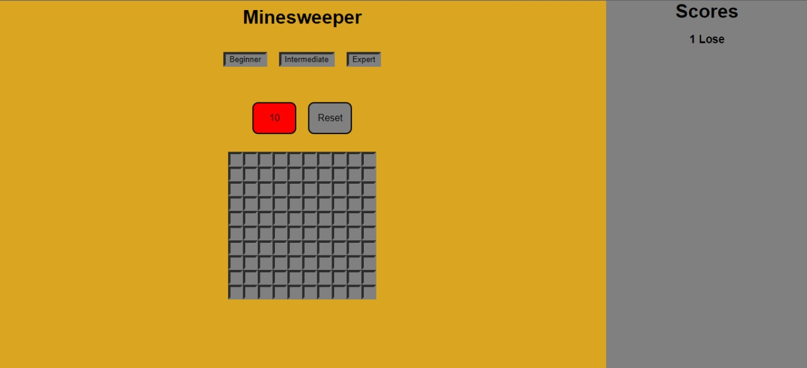

# buscaminas-react
Juego buscaminas hecho en React

## How to run

Clone or fork this repository, go to your destination folder and run:

```
npm install
npm run start
```

The process will automaticaly open the game in a new browser tab.


## Notes 




I decided to do it with React because of the componentization and the easy handling provided by the framework, but it could be solved with pure javascript.
I could not finish all the extra tasks since I only had 3 hours to do it, anyway I will continue to modify it in styles and functionality later.

Thanks.

Juan Castro <juancruzcastro04@gmail.com>
